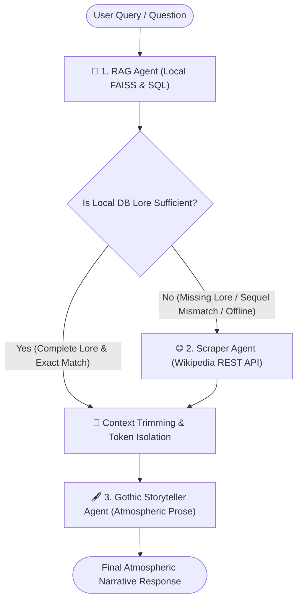

# HorRAGor 👻 — Distributed Multi-Agent Gothic Horror Assistant

[](https://www.python.org/downloads/)
[](https://github.com/langchain-ai/langgraph)
[](https://fastapi.tiangolo.com)
[](https://streamlit.io)
[](https://www.docker.com/)
[](https://nginx.org/)
[]()
[](https://langfuse.com/)
[]()

**HorRAGor** is a production-grade, distributed **Multi-Agent Conversational AI Cluster** specialized in horror cinema lore. Built with **LangGraph**, it orchestrates specialized local researcher agents, live web scrapers, and an atmospheric Gothic Storyteller persona.

The application is fully industrialized: secured via **OAuth2 with asymmetric RS256 JWT tokens**, fronted by an **Nginx reverse proxy with TLS/HTTPS termination**, monitored via **Langfuse distributed tracing**, and containerized across multi-stage Docker images.

100% sovereign local LLM inference via **Ollama** (`qwen2.5:7b` & `nomic-embed-text`) — no paid third-party API keys required.

---

## 🏛️ Full-Stack Cluster Architecture

```text
                           PUBLIC INGRESS (Browser Client)
                                         │
        ┌────────────────────────────────┴────────────────────────────────┐
        │                                                                │
        ▼ Port 80 (HTTP)                                                 ▼ Port 443 (HTTPS)
   ┌───────────────┐                                            ┌───────────────────────┐
   │ Nginx Ingress │ ── 301 Permanent Redirect ───────────────▶ │ Nginx Reverse Proxy   │
   └───────────────┘                                            │ • TLS 1.3 Termination │
                                                                │ • Security Headers    │
                                                                └───────────┬───────────┘
 ═══════════════════════════════════════════════════════════════════════════╪═════════════════════════
                         PRIVATE DOCKER NETWORK (horragor-net)               │
                                                                             │
                    ┌────────────────────────────────────────────────────────┴──────────────┐
                    ▼                                                                       ▼
   ┌─────────────────────────────────┐                                     ┌─────────────────────────────────┐
   │ Streamlit Frontend (:8501)      │                                     │ FastAPI Backend (:8000)         │
   │ • Gothic Chat UI                │                                     │ • OAuth2 RS256 Auth Gatekeeper  │
   │ • WebSocket Streaming           │ ── Bearer Token API Calls (/chat) ─▶│ • Preloaded FAISS In-Memory     │
   │ • Token & Session Management    │                                     │ • Multi-Agent LangGraph Engine  │
   └─────────────────────────────────┘                                     └────────────────┬────────────────┘
                                                                                            │
                                ┌───────────────────────────────────────────────────────────┴───────┐
                                ▼                                                                   ▼
               ┌─────────────────────────────────┐                                 ┌─────────────────────────────────┐
               │ LangGraph Multi-Agent Pipeline  │                                 │ Langfuse Observability (:3000)  │
               │ • RAG Node (FAISS + Supabase)   │ ── Async Telemetry Handshake ──▶│ • Step-by-Step Trace Trees      │
               │ • Router (Sequel & Lore Checks) │   (CallbackHandler)             │ • Latency Breakdowns (ms)       │
               │ • Scraper Node (Wikipedia)      │                                 │ • Token Counts & Cost Metrics   │
               │ • Context Trimming              │                                 └─────────────────────────────────┘
               │ • Gothic Narration (Ollama)     │
               └─────────────────────────────────┘
```

---

## 🤖 The LangGraph Multi-Agent Engine

Instead of a single monolithic model struggling with token bloat and conflicting instructions, HorRAGor partitions responsibilities among specialized autonomous workers:



### The 3 Specialized Agents

1. **🔎 RAG Agent (`rag_node`)**:
   * Performs sub-millisecond vector similarity search over a local **FAISS vector index** (`faiss_index/`) to resolve fuzzy movie titles.
   * Extracts structured SQL metadata (director, release year, genres, cast, rating, local synopsis) from PostgreSQL/Supabase.
   * Generates semantic film recommendations via **pgvector**.
2. **🌐 Scraper Agent (`scraper_node`)**:
   * Dynamically triggers whenever local database facts are missing, incomplete, or when a sequel/number mismatch is detected.
   * Scrapes live plot overviews, trivia, and cast details from the **Wikipedia REST API** with automated disambiguation and film slug prioritization.
3. **🖋️ Narration Agent (`narration_node`)**:
   * Transforms raw factual summaries into chilling, immersive gothic horror prose (in the style of Edgar Allan Poe and H.P. Lovecraft).
   * **Adaptive Bilingualism**: Seamlessly responds in Victorian English or Gothic French matching the user's conversational language.

---

## 🛡️ Enterprise Security & Engineering Highlights

* **🔒 Native OAuth2 with Asymmetric RS256 JWT**:
  Tokens are signed and verified using an asymmetric 2048-bit RSA key pair (`certs/jwt_private.pem` and `certs/jwt_public.pem`). Passwords are salt-hashed using **Argon2 / `pwdlib`**. Includes 30-minute Access Tokens and 7-day Refresh Token rotation.
* **🌐 Nginx Edge Reverse Proxy with TLS 1.3**:
  Terminates SSL/TLS on port `443` and enforces automatic `301 Permanent Redirect` on port `80`. Proxies Streamlit WebSocket connections (`/_stcore/stream`) and FastAPI endpoints (`/auth/`, `/chat`, `/docs`) with hardened security headers (`X-Frame-Options`, `X-Content-Type-Options`).
* **🧹 Context Trimming & Token Isolation**:
  The Gothic Writer agent never sees raw JSON schemas, database logs, or tool error traces. Only an isolated, factual synthesis is injected, completely eliminating context drowning and hallucinations.
* **🧠 Short-Term Conversational Memory & Anaphora Resolution**:
  Follow-up questions with pronouns (*"Who directed The Thing?"* $\rightarrow$ *"What year was **it** released?"*) automatically bind to the active entity stored in session memory across turns.
* **🎯 Sequel & Mismatch Detection Routing**:
  If a user asks for a sequel (e.g. *Scary Movie 3*) that is not in the local horror database, the router detects the title mismatch and automatically routes the query to the Wikipedia Scraper Agent.
* **📊 Langfuse Observability & Telemetry**:
  Equipped with a non-blocking `CallbackHandler` that records real-time execution trace trees, node latencies, and token consumption to a local Langfuse dashboard.

---

## 📁 Repository Structure

```text
horragor2_K/
├── src/
│   ├── auth/                     # Native OAuth2 & JWT Security Service
│   │   ├── keys.py               # 2048-bit RSA key pair generator & loader
│   │   ├── models.py             # Pydantic user, token, & credentials schemas
│   │   ├── router.py             # /auth/register, /auth/login, /auth/refresh, /auth/me
│   │   ├── security.py           # Argon2 password hashing & RS256 token creation
│   │   └── service.py            # User persistence & get_current_user security guard
│   ├── graph/                    # Multi-Agent LangGraph System
│   │   ├── nodes.py              # Specialized agents (RAG, Scraper, Gothic Writer)
│   │   ├── router.py             # Conditional routing edges & sequel mismatch logic
│   │   └── pipeline.py           # StateGraph compilation & Langfuse CallbackHandler
│   ├── models/
│   │   └── state.py              # HorragorState TypedDict (Shared memory)
│   ├── tools/
│   │   ├── rag_tool.py           # FAISS title matching + SQL metadata extraction
│   │   └── scraper_tool.py       # Wikipedia REST API scraper with fallback
│   ├── config.py                 # Pydantic Settings with enterprise validation guards
│   ├── main.py                   # FastAPI application with lifespan FAISS preloading
│   ├── front/                    # [Legacy Part 2] Archived prototype UI & common API client
│   └── backend/                  # [Legacy Part 2] Archived monolithic ReAct agent & tools
├── nginx/
│   └── nginx.conf                # Nginx reverse proxy, TLS termination & WS streaming
├── scripts/
│   └── generate_tls_certs.py     # Automated self-signed X.509 SSL cert generator
├── tests/
│   └── test_multi_agent_pipeline.py  # 10 unit & integration tests (100% passing)
├── Dockerfile.backend            # Lightweight Python 3.12 + uv container for FastAPI
├── Dockerfile.frontend           # Streamlit headless UI container (runs app_frontend.py)
├── docker-compose.yml            # Multi-container cluster orchestration
├── .dockerignore                 # Build context optimizer
├── app_frontend.py               # Active Streamlit UI with OAuth2 login tabs & context inspector
├── faiss_index/                  # Local FAISS index & title vector mappings
└── docs/
    └── partie3-multi-agent-guide.md  # Comprehensive engineering & implementation guide
```

> [!NOTE] Frontend Evolution: `app_frontend.py` vs. `src/front/`
> * **Active Production Frontend (`app_frontend.py`)**: Located at the project root as specified by the Part 3 & 4 architecture. It integrates native OAuth2/JWT session management, Context Trimming inspection, source attribution badges, and Docker/Nginx reverse proxy support.
> * **Archived Prototype (`src/front/` & `src/backend/`)**: Contains the original unauthenticated Part 2 ReAct agent and simple chat UI, preserved for academic traceability and backward compatibility.

---

## 🚀 Quickstart & Deployment

### Prerequisites

* [Docker Desktop](https://www.docker.com/) (for containerized deployment)
* [Ollama](https://ollama.com/) running on the host with the required models:
  ```powershell
  ollama pull qwen2.5:7b
  ollama pull nomic-embed-text
  ```

---

### Option A: Launch Full Containerized Cluster (Recommended)

1. **Generate TLS Certificates** (run once to create `certs/nginx/server.crt` & `server.key`):
   ```powershell
   python scripts/generate_tls_certs.py
   ```

2. **Start the Cluster**:
   ```powershell
   docker compose up --build
   ```

3. **Access the Secured Stack**:
   * **Streamlit Gothic UI**: [https://localhost](https://localhost) *(or [http://localhost](http://localhost) auto-redirects to HTTPS)*
   * **FastAPI Swagger Docs**: [https://localhost/docs](https://localhost/docs)
   * *(Accept the local self-signed certificate warning in your browser).*

---

### Option B: Local Interactive Development Mode

If you prefer to run services directly on your host machine:

1. **Install Dependencies**:
   ```powershell
   uv sync --extra dev
   ```

2. **Terminal 1: Start FastAPI Backend**:
   ```powershell
   python -m uvicorn src.main:app --reload --port 8000
   ```
   * Swagger Docs: [http://localhost:8000/docs](http://localhost:8000/docs)
   * Healthcheck: [http://localhost:8000/health](http://localhost:8000/health)

3. **Terminal 2: Start Streamlit Frontend**:
   ```powershell
   python -m streamlit run app_frontend.py
   ```
   * Chat UI: [http://localhost:8501](http://localhost:8501)

---

## 🧪 Automated Test Suite

HorRAGor includes 11 automated unit and integration tests covering graph branching, context trimming, StateGraph topology, health endpoints, anaphoric memory, OAuth2 registration/login, route blocking on `/chat`, Langfuse validation guards, and smart director mismatch detection:

```powershell
python -m pytest tests/test_multi_agent_pipeline.py -v
```

**Verification Output:**
```text
tests/test_multi_agent_pipeline.py::test_router_conditional_branching PASSED [  9%]
tests/test_multi_agent_pipeline.py::test_context_summary_building PASSED     [ 18%]
tests/test_multi_agent_pipeline.py::test_pipeline_graph_structure PASSED     [ 27%]
tests/test_multi_agent_pipeline.py::test_fastapi_health_endpoint PASSED      [ 36%]
tests/test_multi_agent_pipeline.py::test_anaphoric_title_resolution PASSED   [ 45%]
tests/test_multi_agent_pipeline.py::test_auth_registration_and_login PASSED  [ 54%]
tests/test_multi_agent_pipeline.py::test_unauthorized_chat_blocked PASSED    [ 63%]
tests/test_multi_agent_pipeline.py::test_fastapi_chat_endpoint_mocked PASSED [ 72%]
tests/test_multi_agent_pipeline.py::test_langfuse_settings_validation PASSED  [ 81%]
tests/test_multi_agent_pipeline.py::test_langfuse_callback_instantiation PASSED [ 90%]
tests/test_multi_agent_pipeline.py::test_director_mismatch_triggers_scraper PASSED [100%]

======================= 11 passed, 1 warning in 10.98s =======================
```

---

## 💡 Example Conversational Queries

* **English**:
  * *"Who directed the film The Thing and what year was it released?"*
  * *(Follow-up with pronoun)* *"What was its plot and who starred in it?"*
  * *(Sequel fallback test)* *"Who directed Scary Movie 3?"*
* **Français**:
  * *"Qui a réalisé Hereditary et que raconte ce film ?"*
  * *(Suivi anaphorique)* *"Quels sont les acteurs qui jouent dedans ?"*
  * *"Quels sont les films d'horreur similaires à The Shining ?"*

---

## 📜 Technology Stack

* **Agents & Orchestration**: LangGraph · LangChain · Ollama (`qwen2.5:7b`)
* **Vector & Storage**: FAISS (`nomic-embed-text`) · PostgreSQL / Supabase · pgvector
* **Web Scraping**: Wikipedia REST API · OpenSearch API
* **Security & Auth**: OAuth2 · JWT RS256 · `pwdlib` (Argon2) · X.509 TLS Certificates
* **Infrastructure & Ingress**: Nginx (Reverse Proxy & TLS Termination) · Docker · Docker Compose
* **Observability**: Langfuse (`CallbackHandler`)
* **Package Management & Tooling**: Astral `uv` · Pytest · Pydantic v2
