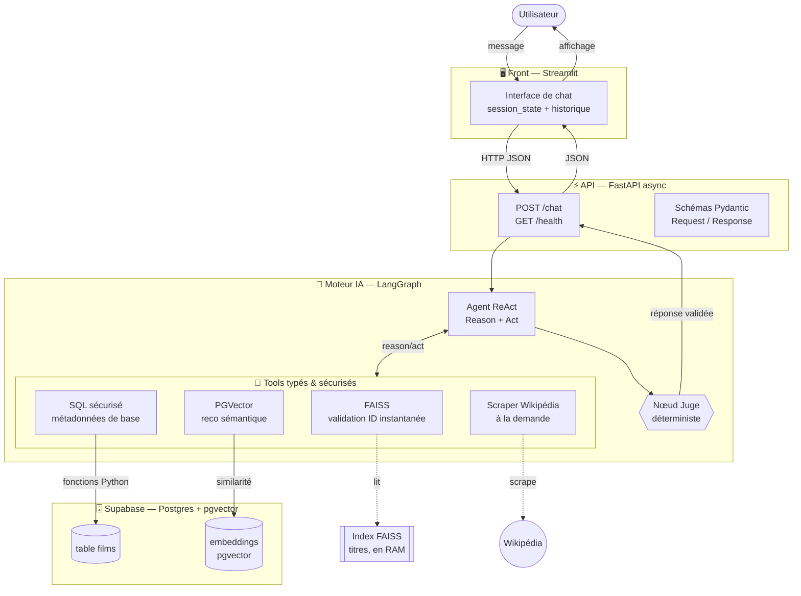
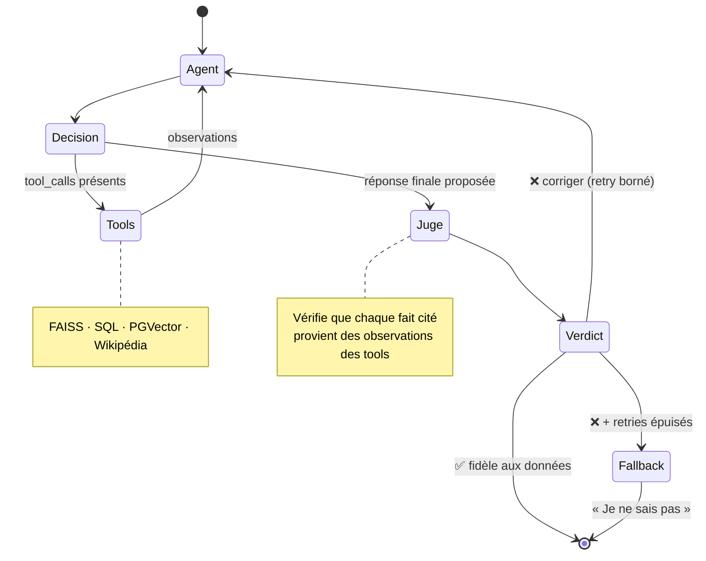

# HorRAGor2 — Architecture

Agent conversationnel RAG (LangGraph, boucle ReAct) sur une base de films d'horreur,
exposé via une API FastAPI asynchrone et une interface de chat Streamlit.

> Statut : architecture validée. Choix LLM / embeddings et répartition des rôles : à définir.

---

## 1. Principes directeurs

Dérivés des critères de performance du brief :

1. **Aucun SQL brut généré par le LLM.** Le modèle n'appelle que des **fonctions Python typées** (Tools). Le SQL vit uniquement dans le connecteur.
2. **Routage instantané.** Un index **FAISS en RAM** valide l'existence d'un film et renvoie son `id` (titres uniquement).
3. **Zéro hallucination sur les métadonnées de base.** Réalisateur / année / genre proviennent exclusivement du connecteur SQL ; un **nœud Juge déterministe** le vérifie avant affichage.
4. **Scraping strictement sélectif.** Wikipédia ne se déclenche que si la question exige un détail introuvable en base.
5. **Aucun gel d'écran.** Routes FastAPI asynchrones ; Streamlit ne fait que des appels HTTP.
6. **« Je ne sais pas » maîtrisé.** Si le film est absent de la base ET de Wikipédia, l'agent l'admet poliment.

---

## 2. Vue système



---

## 3. Graphe de l'agent (livrable « Schéma du Graphe »)



### Nœud Juge — validation déterministe

Pas de second appel LLM. Le Juge est du **code** :

- Il reçoit la réponse candidate de l'agent **et** les observations brutes renvoyées par les tools durant le tour.
- Pour chaque métadonnée de base affirmée (réalisateur, année, genre), il vérifie la présence **littérale** de la valeur dans les données du connecteur SQL.
- Verdict :
  - **Validé** → la réponse part vers l'API.
  - **Rejeté + retries restants** → retour à l'agent avec un message correctif.
  - **Rejeté + retries épuisés** → fallback « Je ne sais pas ».

---

## 4. Les Tools (noms du PDF)

| Tool | Source | Rôle | Déclenchement |
|---|---|---|---|
| `validate_film` (routeur FAISS) | Index FAISS (RAM, **titres seulement**) | Confirme l'existence d'un film et renvoie son `id` | Systématique (routage) |
| `query_movie_metadata` | Supabase SQL (fonction typée) | Réalisateur, année, genre, note moyenne, casting | Dès qu'un `id` est résolu |
| `find_similar_horror_movies` | Supabase PGVector | Films sémantiquement proches | Sur demande de reco |
| `scrape_detailed_synopsis` | Scraping Wikipédia | Enrichit le synopsis | **Strictement sélectif** |
| `calculate_movie_age` | Python natif (déterministe) | Calcule l'âge du film | Sur demande temporelle |
| `horror_survival_simulator` | LLM (optionnel) | Simulateur de survie ludique | Optionnel |

FAISS = validation d'identifiant uniquement. Toute recherche sémantique (similarité de contenu) passe par **PGVector**, pas par FAISS. Aucun calcul (ex. âge) n'est laissé au LLM : un tool Python le fait.

---

## 5. Modèle de données (Supabase — à confirmer avec le golden data)

La base est actuellement vide. Schéma de départ :

| Colonne | Type | Rôle |
|---|---|---|
| `id` | `bigint` PK | Identifiant film (clé de routage FAISS) |
| `title` | `text` | Titre — indexé dans FAISS |
| `director` | `text` | Métadonnée « zéro hallucination » |
| `release_year` | `int` | Métadonnée « zéro hallucination » |
| `genre` | `text` / `text[]` | Métadonnée « zéro hallucination » |
| `rating` | `numeric` | Note moyenne |
| `cast` | `text[]` | Casting |
| `synopsis` | `text` | Synopsis de base |
| `embedding` | `vector(N)` | pgvector — reco sémantique |

`N` = dimension du modèle d'embeddings (à choisir). Le **golden data** sera fourni ultérieurement et figera le schéma définitif.

---

## 6. Contrats d'interface (travail en parallèle des 3 briques)

Ces contrats permettent aux 3 personnes d'avancer sans se bloquer.

### Streamlit ⇄ API
```
POST /chat
  → { "message": str, "session_id": str }
  ⇒ { "answer": str, "sources": [...], "trace": {...} }

GET /health ⇒ { "status": "ok" }
```

### API ⇄ Moteur
```python
async def run_agent(message: str, session_id: str) -> AgentResult
```
`AgentResult` = réponse finale + sources + trace d'exécution du graphe.

### Moteur ⇄ Données
Module `backend/tools/` : chaque tool a une signature typée stable.
```python
def validate_film(title: str) -> FilmRef | None
def query_movie_metadata(film_id: int) -> FilmMetadata
def find_similar_horror_movies(film_id: int, k: int = 5) -> list[FilmRef]
def scrape_detailed_synopsis(title: str) -> str | None
def calculate_movie_age(release_year: int) -> int
```

---

## 7. Arborescence cible (proposition)

```
HorRAGor2/
├── .streamlit/config.toml   # thème sombre "Chat Horror" (committé)
├── src/
│   ├── front/               # Streamlit (app.py, api_client.py)
│   └── backend/
│       ├── config.py        # réglages (.env)
│       ├── contracts/       # schémas Pydantic + interfaces (Protocols)
│       ├── mocks/           # faux moteur + fixtures
│       ├── api/             # FastAPI (routes async)
│       ├── agent/           # graphe LangGraph, juge déterministe, prompts
│       ├── tools/           # FAISS, SQL, PGVector, Wikipédia, calcul d'âge
│       └── data/            # ingestion, embeddings, build index FAISS
├── docs/architecture.md
├── tests/
├── pyproject.toml
└── .env.example
```

---

## 8. Décisions ouvertes

- [ ] Fournisseur **LLM** (agent ReAct).
- [ ] Modèle d'**embeddings** (fixe `N` et la cohérence FAISS/PGVector).
- [ ] Répartition des **rôles** (application / API / BDD-FAISS) + boucle ReAct commune.
- [ ] Schéma de données définitif (au reçu du **golden data**).
