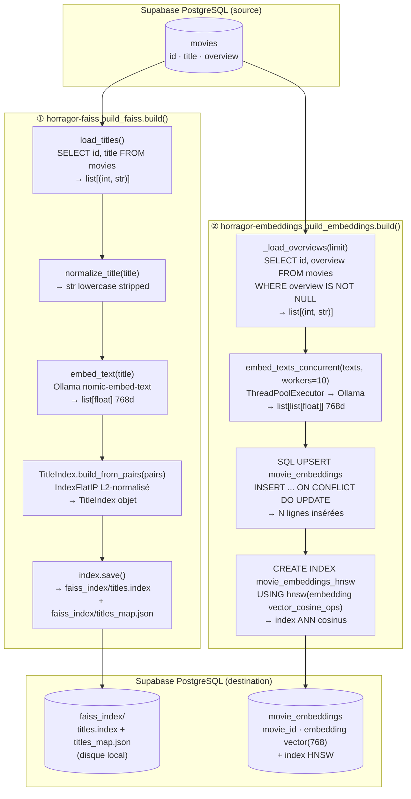
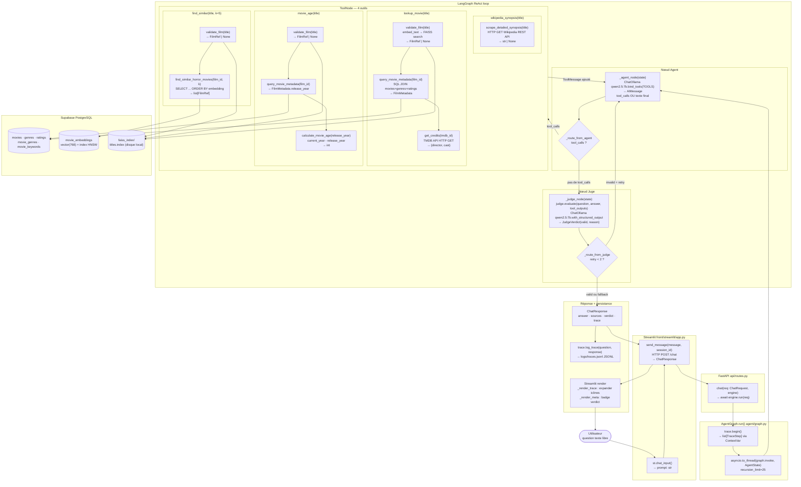

# Lifecycle des données — HorRAGor2

Deux flux cohabitent dans HorRAGor2 :
- **Préparation (offline)** : construire index FAISS + embeddings depuis Supabase
- **Requête (online)** : question → agent ReAct → outils → Supabase → réponse

---

## Lifecycle 1 — Préparation des données (commandes offline)

Exécutées une fois (ou après `horragor-reset-data`). Supabase est la source ET la destination
pour les embeddings.

### Fonctions

#### ① Index FAISS des titres (`uv run horragor-faiss`)

| Fonction | Fichier | Entrée | Sortie |
|---|---|---|---|
| `build(limit)` | `data/build_faiss.py` | `limit: int \| None` | — (effets disque) |
| `load_titles()` | `data/titles.py` | `DATABASE_URL` env | `list[tuple[int, str]]` (id, titre) |
| `TitleIndex.build_from_pairs(pairs, workers=10)` | `data/faiss_index.py` | `list[(int, str)]` | `TitleIndex` (IndexFlatIP L2-normalisé) |
| `normalize_title(title)` | `data/faiss_index.py` | `str` | `str` lowercase stripped |
| `embed_text(title)` | `data/embed.py` | `str` | `list[float]` 768 dims (nomic-embed-text) |
| `index.save()` | `data/faiss_index.py` | — | `faiss_index/titles.index` + `titles_map.json` |

#### ② Embeddings pgvector (`uv run horragor-embeddings`)

| Fonction | Fichier | Entrée | Sortie |
|---|---|---|---|
| `build(limit, batch=500)` | `data/build_embeddings.py` | `limit: int \| None`, `batch: int` | — (effets SQL) |
| `_load_overviews(limit)` | `data/build_embeddings.py` | `limit: int \| None` | `list[tuple[int, str]]` (id, overview) |
| `embed_texts_concurrent(texts, workers=10)` | `data/embed.py` | `list[str]` | `list[list[float]]` 768 dims |
| SQL UPSERT | `data/build_embeddings.py` | `(movie_id, vector)` | table `movie_embeddings` mise à jour |
| `CREATE INDEX movie_embeddings_hnsw` | `data/build_embeddings.py` | — | index HNSW cosinus sur `movie_embeddings` |

---

## Lifecycle 2 — Requête runtime (par question utilisateur)

### Fonctions

#### ① Streamlit UI → API

| Fonction | Fichier | Entrée | Sortie |
|---|---|---|---|
| `st.chat_input()` | `front/streamlit/app.py` | — | `prompt: str` |
| `send_message(message, session_id)` | `front/common/api_client.py` | `str`, `str` | `ChatResponse` |
| HTTP POST `/chat` | — | `ChatRequest` JSON | `ChatResponse` JSON |

#### ② FastAPI → Agent

| Fonction | Fichier | Entrée | Sortie |
|---|---|---|---|
| `chat(req, engine)` | `api/routes.py` | `ChatRequest`, `AgentEngine` | `ChatResponse` |
| `AgentGraph.run(req)` | `agent/graph.py` | `ChatRequest` | `ChatResponse` |
| `trace.begin()` | `backend/trace.py` | — | `list[TraceStep]` (collecteur ContextVar) |
| `asyncio.to_thread(graph.invoke, state)` | `agent/graph.py` | `AgentState` | `AgentState` final |

#### ③ Nœud Agent (LangGraph ReAct)

| Fonction | Fichier | Entrée | Sortie |
|---|---|---|---|
| `_agent_node(state)` | `agent/graph.py` | `AgentState` | `{"messages": [AIMessage]}` |
| `ChatOllama("qwen2.5:7b").bind_tools(TOOLS).invoke(messages)` | — | `list[Message]` | `AIMessage` (tool_calls ou texte final) |
| `_route_from_agent(state)` | `agent/graph.py` | `AgentState` | `"tools"` ou `"judge"` |

#### ④ Outils (ToolNode LangChain)

**Tool 1 : `lookup_movie(title: str) → dict`**

| Sous-fonction | Fichier | Entrée | Sortie |
|---|---|---|---|
| `faiss_tool.validate_film(title)` | `tools/faiss_tool.py` | `str` | `FilmRef \| None` |
| `embed_text(title)` | `data/embed.py` | `str` | `list[float]` 768d |
| `index.search_vector(vector, k=1)` | `data/faiss_index.py` | `list[float]` | `list[(score, id, title)]` |
| `sql_tool.query_movie_metadata(film_id)` | `tools/sql_tool.py` | `int` | `FilmMetadata \| None` |
| SQL JOIN movies+genres+ratings | Supabase | `film_id` | métadonnées complètes |
| `tmdb.get_credits(tmdb_id)` | `data/tmdb.py` | `int` | `{"director": str, "cast": list[str]}` |

**Tool 2 : `find_similar(title: str, k: int) → dict`**

| Sous-fonction | Fichier | Entrée | Sortie |
|---|---|---|---|
| `faiss_tool.validate_film(title)` | `tools/faiss_tool.py` | `str` | `FilmRef \| None` |
| `pgvector_tool.find_similar_horror_movies(film_id, k)` | `tools/pgvector_tool.py` | `int`, `int` | `list[FilmRef]` |
| SQL `ORDER BY embedding <=> (SELECT embedding … WHERE movie_id=:id)` | Supabase | `film_id`, `k` | k films les plus proches (cosinus) |

**Tool 3 : `movie_age(title: str) → dict`**

| Sous-fonction | Fichier | Entrée | Sortie |
|---|---|---|---|
| `faiss_tool.validate_film(title)` | `tools/faiss_tool.py` | `str` | `FilmRef \| None` |
| `sql_tool.query_movie_metadata(film_id)` | `tools/sql_tool.py` | `int` | `FilmMetadata \| None` |
| `temporal_tool.calculate_movie_age(release_year)` | `tools/temporal_tool.py` | `int` | `int` (âge en années) |

**Tool 4 : `wikipedia_synopsis(title: str) → str \| None`**

| Sous-fonction | Fichier | Entrée | Sortie |
|---|---|---|---|
| `wikipedia_tool.scrape_detailed_synopsis(title)` | `tools/wikipedia_tool.py` | `str` | `str \| None` |
| HTTP GET Wikipedia REST API summary | Wikipedia | slug titre | extract texte |

#### ⑤ Nœud Juge

| Fonction | Fichier | Entrée | Sortie |
|---|---|---|---|
| `_judge_node(state)` | `agent/graph.py` | `AgentState` | `{"verdict": str}` |
| `judge.evaluate(question, answer, tool_outputs)` | `agent/judge.py` | `str`, `str`, `list[str]` | `tuple[bool, str]` |
| `ChatOllama("qwen2.5:7b").with_structured_output(JudgeVerdict).invoke(…)` | — | messages | `JudgeVerdict(valid, reason)` |
| `_route_from_judge(state)` | `agent/graph.py` | `AgentState` | `"agent"` (retry) ou `END` |

#### ⑥ Réponse et persistance

| Fonction | Fichier | Entrée | Sortie |
|---|---|---|---|
| `trace.record(kind, name, detail)` | `backend/trace.py` | `str`, `str`, `str` | ajoute `TraceStep` au collecteur |
| `trace.log_trace(question, response)` | `backend/trace.py` | `str`, `ChatResponse` | ligne JSONL dans `logs/traces.jsonl` |
| `_render_trace(entry)` | `front/streamlit/app.py` | `dict` | expander Streamlit avec icônes |

---

## Diagramme Mermaid 1 — Préparation des données (offline)

---

## Diagramme Mermaid 2 — Requête runtime (online)

